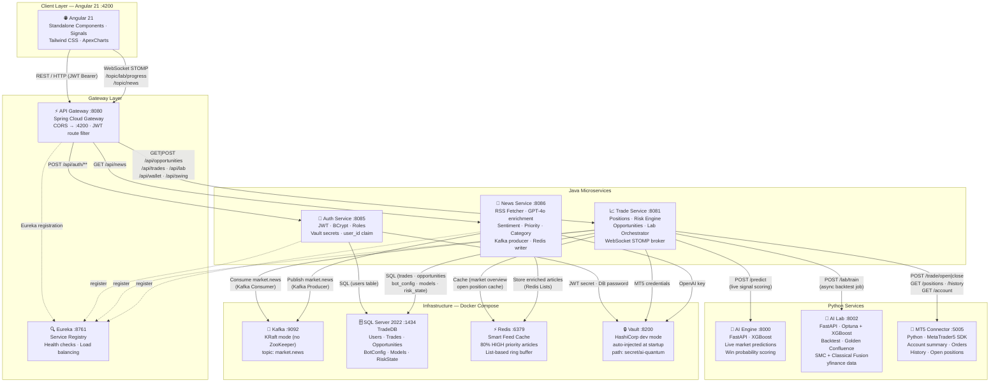
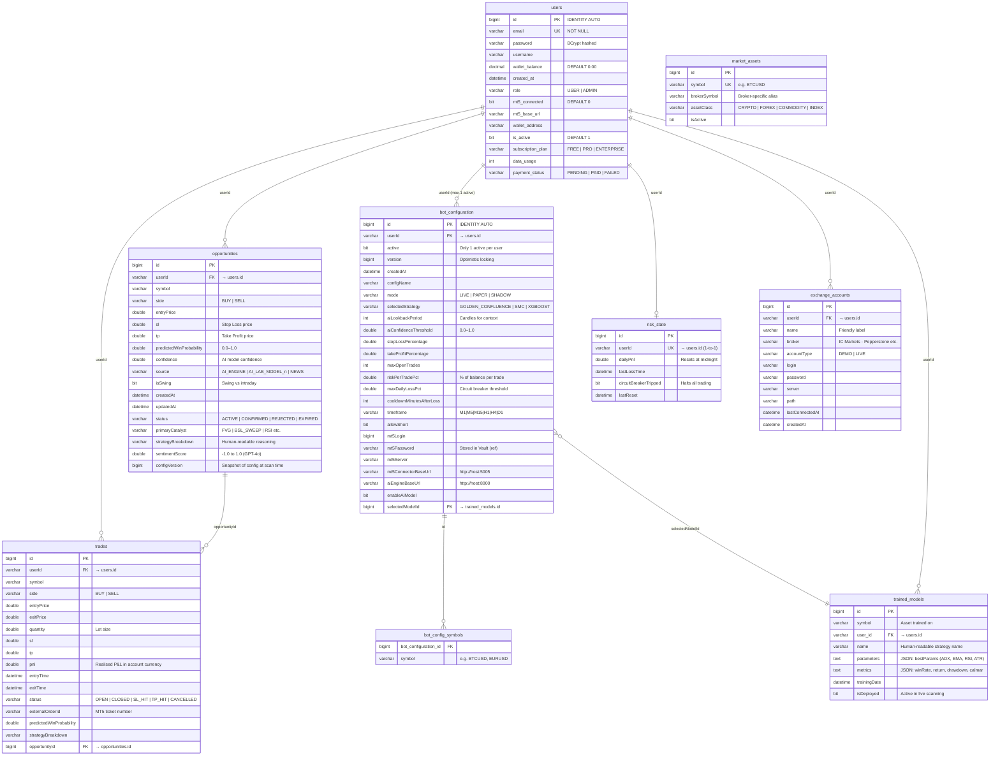
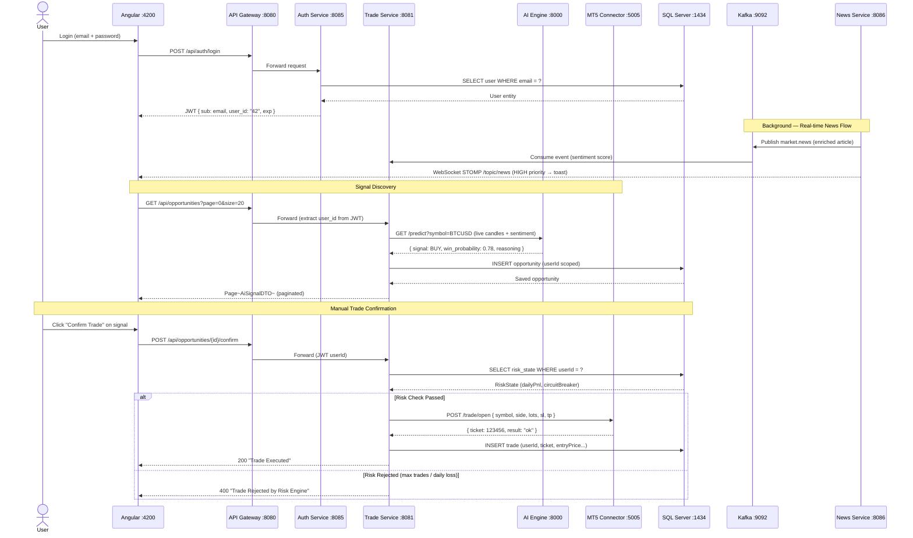
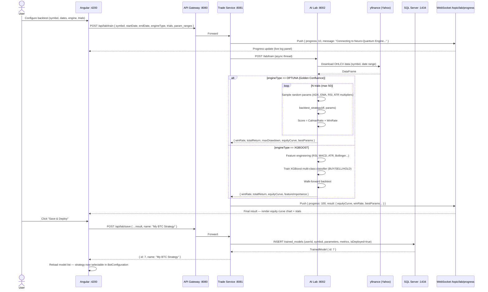
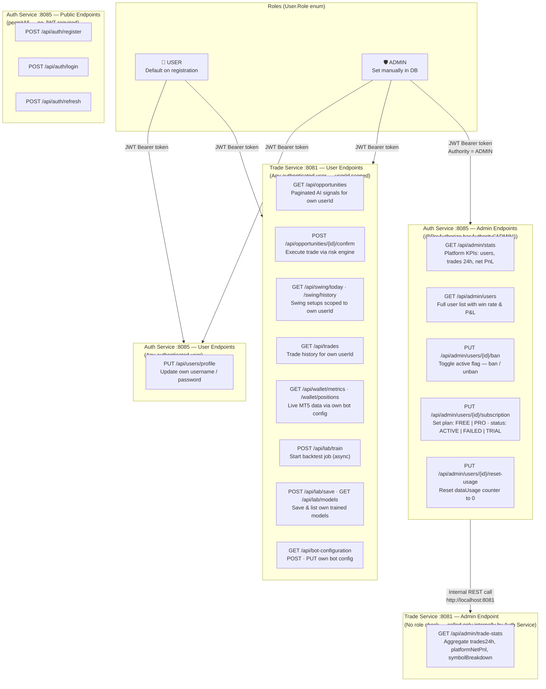
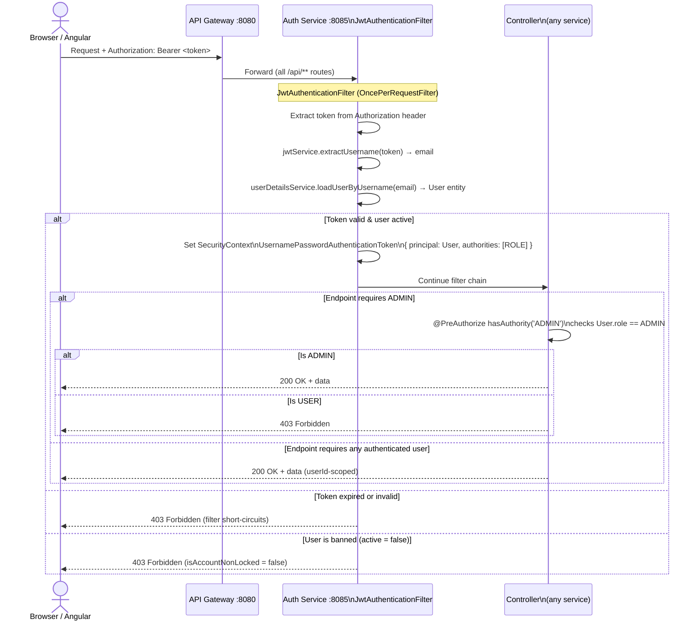
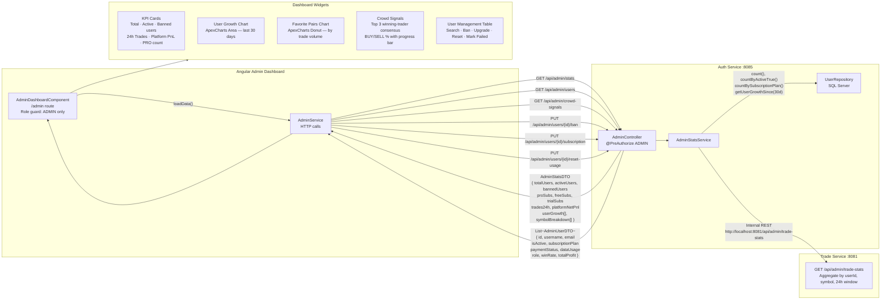

# AI-Quantum Trader — Architecture & Diagrams

> **How to view:** Install the VS Code extension **"Markdown Preview Mermaid Support"** (ID: `bierner.markdown-mermaid`), then open this file and press `Ctrl+Shift+V` to preview.
>
> Or paste any diagram block at [https://mermaid.live](https://mermaid.live)

---

## 1. System Architecture

---

## 2. Database Schema (TradeDB — SQL Server 2022)

---

## 3. Class Diagram — Core Services

```mermaid
classDiagram
    %% ── Domain Models ──────────────────────────────────────────
    class User {
        +Long id
        +String email
        +String username
        +BigDecimal walletBalance
        +Role role
        +boolean mt5Connected
        +SubscriptionPlan subscriptionPlan
        +PaymentStatus paymentStatus
        +getAuthorities() Collection~GrantedAuthority~
    }

    class Trade {
        +Long id
        +String userId
        +String symbol
        +String side
        +Double entryPrice
        +Double exitPrice
        +Double quantity
        +Double sl
        +Double tp
        +Double pnl
        +String status
        +String externalOrderId
        +Long opportunityId
    }

    class Opportunity {
        +Long id
        +String userId
        +String symbol
        +String side
        +Double entryPrice
        +Double sl
        +Double tp
        +Double predictedWinProbability
        +Double confidence
        +String source
        +Boolean isSwing
        +String status
        +String primaryCatalyst
        +String strategyBreakdown
        +Double sentimentScore
    }

    class BotConfiguration {
        +Long id
        +String userId
        +boolean active
        +String mode
        +List~String~ symbols
        +Double aiConfidenceThreshold
        +Double stopLossPercentage
        +Double takeProfitPercentage
        +Integer maxOpenTrades
        +Double riskPerTradePct
        +Double maxDailyLossPct
        +Integer cooldownMinutesAfterLoss
        +String timeframe
        +Long mt5Login
        +String mt5ConnectorBaseUrl
        +String aiEngineBaseUrl
        +Long selectedModelId
    }

    class TrainedModel {
        +Long id
        +String symbol
        +String userId
        +String name
        +String parameters
        +String metrics
        +LocalDateTime trainingDate
        +boolean isDeployed
    }

    class RiskState {
        +Long id
        +String userId
        +Double dailyPnl
        +LocalDateTime lastLossTime
        +boolean circuitBreakerTripped
        +LocalDateTime lastReset
    }

    %% ── Trade Service: Core Services ────────────────────────────
    class UserContextService {
        +getCurrentUserId() String
        +getCurrentUser() UserProfile
        -extractFromJwt(Authentication) String
    }

    class TradeExecutionService {
        +processOpportunity(Opportunity, BotConfiguration) boolean
        -checkRiskLimits(BotConfiguration, RiskState) boolean
        -calculateLotSize(BotConfiguration, double) double
        -executeMt5Order(Opportunity, BotConfiguration) String
    }

    class TradeSyncService {
        +syncTrades(String userId) void
        -mapDealReasonToStatus(int reason) String
        -updateLivePositions(String userId, String mt5Url) void
    }

    class WalletService {
        +getWalletMetrics() WalletMetricsDTO
        +getLivePositions() List~Mt5Position~
        +getMarketOverview() List~MarketAssetOverviewDTO~
        +closeTrade(Long ticket) OrderResponse
        -getUserMt5Url(String userId) Optional~String~
    }

    class LabService {
        +startTraining(TrainingRequestDTO) String jobId
        +saveModel(Map result, String userId) TrainedModel
        +getTrainedModels(String userId) List~TrainedModel~
        +getActiveStrategies(String userId) List~ActiveStrategyDTO~
        -PYTHON_SERVICE_URL String "http://localhost:8002/lab/train"
    }

    class OpportunityScannerService {
        +scanForOpportunities() void
        -fetchAiSignal(String symbol, BotConfiguration) Opportunity
    }

    class SwingTradingService {
        +scanForSwingTrades() void
        -expireOldSignals() void
    }

    %% ── Trade Service: Controllers ──────────────────────────────
    class OpportunityController {
        +getOpportunities(page, size, symbol) Page~AiSignalDTO~
        +getTodaySwingSetups() List~AiSignalDTO~
        +getSwingHistory(page, size) Page~AiSignalDTO~
        +confirmOpportunity(Long id) ResponseEntity
        +triggerSwingScan() ResponseEntity
    }

    class TradeController {
        +getAllTrades(page, size, symbol) Page~Trade~
        +getLivePositions() List~Mt5Position~
        +syncTrades() ResponseEntity
    }

    class LabController {
        +startTraining(TrainingRequestDTO) ResponseEntity
        +saveModel(Map) ResponseEntity
        +getModels() List~TrainedModel~
        +getActiveStrategies() List~ActiveStrategyDTO~
    }

    class WalletController {
        +getWalletMetrics() WalletMetricsDTO
        +getLivePositions() List~Mt5Position~
        +getMarketOverview() List~MarketAssetOverviewDTO~
        +closeTrade(Long ticket) ResponseEntity
    }

    %% ── Python AI Lab Engine (service-ai-lab :8002) ─────────────
    class LabEngine {
        +run_optimization(symbol, dates, indicators, target_wr, n_trials, param_ranges) dict
        +predict(market_data, indicators, params, news_sentiment, asset_class) dict
        +fetch_data(symbol, start_date, end_date) DataFrame
        +backtest_strategy(df, params) tuple
        -COMMISSION_RATE = 0.0005
        -SLIPPAGE_RATE = 0.0001
    }

    class FusionArbiter {
        +judge(df, asset_class) dict
        -core_a ClassicalBrain
        -core_b SmartMoneyBrain
    }

    class ClassicalBrain {
        +analyze(df) dict
        -RSI window=14
        -MACD standard
        -EMA_50 EMA_200
    }

    class SmartMoneyBrain {
        +analyze(df) dict
        -detect_fvg(df) dict
        -detect_liquidity_sweep(df) dict
        -is_in_killzone(time) bool
        -LondonOpen 02:00–05:00 EST
        -NewYorkOpen 07:00–10:00 EST
    }

    %% ── Relationships ───────────────────────────────────────────
    WalletService --> BotConfiguration : reads config
    WalletService --> Trade : filters by userId
    TradeExecutionService --> Opportunity : processes
    TradeExecutionService --> BotConfiguration : applies risk rules
    TradeExecutionService --> RiskState : checks & updates
    TradeSyncService --> Trade : syncs from MT5
    LabService --> TrainedModel : persists
    LabService ..> LabEngine : REST POST /lab/train

    OpportunityController --> UserContextService : getCurrentUserId
    TradeController --> UserContextService : getCurrentUserId
    LabController --> LabService : delegates
    WalletController --> WalletService : delegates

    FusionArbiter --> ClassicalBrain : weight 30%
    FusionArbiter --> SmartMoneyBrain : weight 70%
    LabEngine --> FusionArbiter : predict()

    Opportunity "1" --> "0..*" Trade : generates
    BotConfiguration "1" --> "0..1" TrainedModel : uses
    UserContextService ..> User : identifies via JWT
```

---

## 4. Request Flow — Trade Execution

---

## 5. AI Lab — Backtest & Training Flow

---

## 6. Role & Access Control Diagram

### 6a. Role Hierarchy & Permissions

---

### 6b. JWT Authentication Filter Chain

---

### 6c. Admin Dashboard — Data Flow

